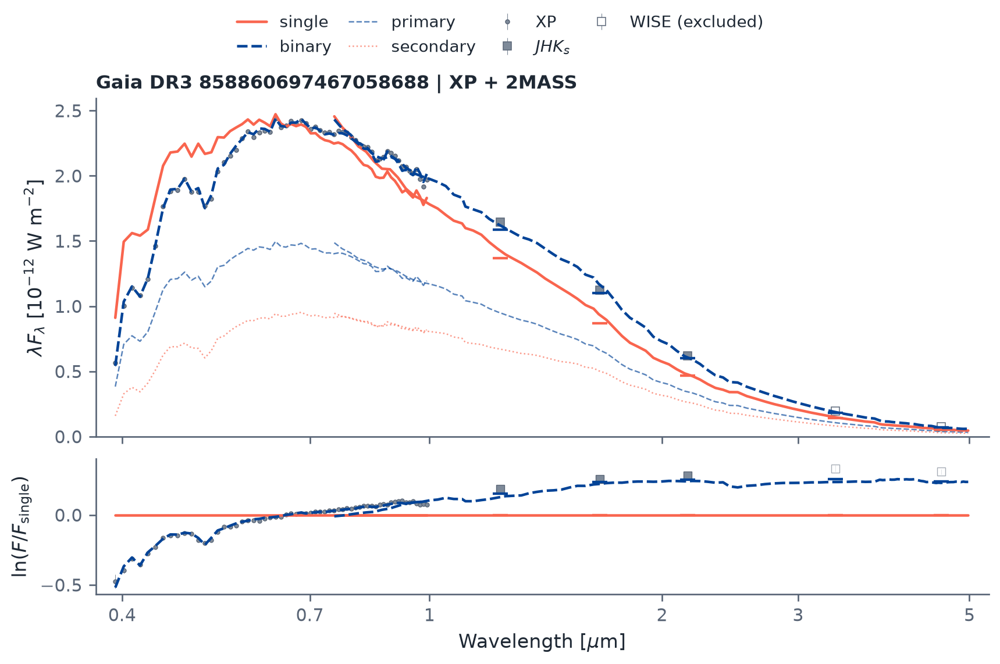
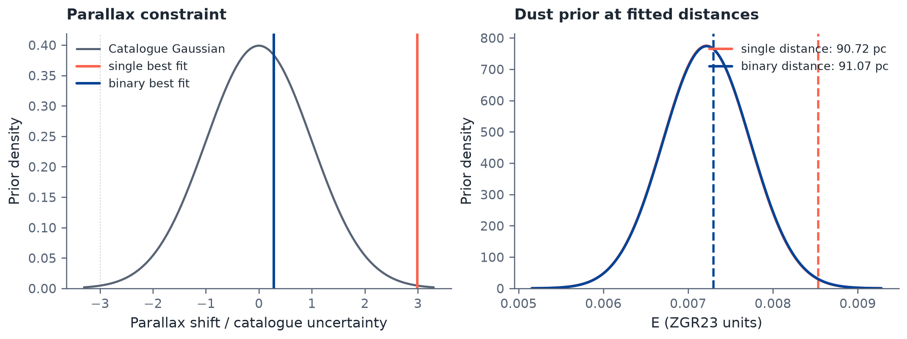

<p align="center">
  
</p>
<p align="center">Download and fit stellar spectral energy distributions.</p>

sedkit combines public Gaia DR3 XP spectra with Gaia-linked 2MASS and
AllWISE photometry. A compact empirical stellar model predicts absolute
fluxes for a single star or a coeval binary, and tells whether a Gaia
astrometric orbit comes from a faint companion or a hidden near-equal-mass
twin. The package runs on NumPy and
SciPy, with no J-CAPS installation, JAX, GPU or separate model download.

## Current fitting capabilities

- **Warm stars:** the bundled IRFM-calibrated dwarf model extends XP and
  2MASS coverage to about 7500 K. The primary-mass search reaches 2.2 solar
  masses, with usable masses depending on age, metallicity and component
  coverage; it is not continuous across every mass range. Warm companions
  can be confused with stellar age. See [model limits](docs/model.md),
  [warm-star validation](docs/validation-warm.md) and [notebook 03](examples/03_warm_binaries.ipynb).
- **Hot stars:** `StellarModel(hot=True)` extends single and binary fits
  to 30 kK on XP and 2MASS, with PARSEC ages from 4 Myr and masses to 20
  solar masses. See the [hot-star route](docs/model.md#hot-star-route) and
  [hot-star validation](docs/validation-hot.md).
- **Extinction:** E defaults to zero. `extinction=None` fits nonnegative
  native ZGR23 E with an [Edenhofer 3D dust prior](docs/extinction.md);
  a numeric `extinction=` fixes E. Attenuation acts on the model flux and
  covariance, preserving the observed fluxes, errors and fitting mask.
- **Parallax:** fixed at the catalogue value by default. `fit_parallax=True`
  fits it within three catalogue standard deviations under a Gaussian
  constraint. The distance-dependent dust prior follows the trial parallax.

## Install

```bash
pip install "sedkit[download] @ git+https://github.com/jiadonglee/sedkit.git"
```

For a local checkout, use `pip install -e ".[download]"`. Plain
`pip install .` supports offline fitting and plotting. Notebooks additionally
need Jupyter: `pip install -e ".[download,notebook]"`. For optional SPHEREx
acquisition, add the `spherex` extra; see [SPHEREx downloads](docs/spherex.md).

## One source

```python
from sedkit import download, fit, plot

sed = download("858860697467058688", cache_dir="data")
result = fit(sed, age_gyr=5.0, feh=0.0)
print(result["binary"]["m1"], result["binary"]["q"])
fig = plot(sed, result, path="sed.png")
```

This example fixes age and metallicity. Use `age_gyr=None, feh=None` to fit
them. Parallax is fixed by default; `fit_parallax=True` fits it with its
catalogue Gaussian constraint. Use `kind="single"`, `kind="binary"`, or the default `kind="both"`;
`q=0.7` fixes the binary mass ratio. `result["delta"]` is the single minus
binary objective, including the parallax constraint when fitted. It is a model
preference diagnostic, not a binary probability.

Coordinates are also accepted: `download(ra=..., dec=...)`, in ICRS degrees
at Gaia's reference epoch. Coordinate lookup requires exactly one Gaia
match within 2 arcsec. Source IDs avoid coordinate-epoch ambiguity.

## Fit extinction and parallax together

Install `pip install -e ".[download,dust,notebook]"` for this tutorial.
Prepare the Edenhofer posterior-sample map once on a server with enough
memory; the full map is about 19 GB and is not downloaded by the fit.

```python
from sedkit import EdenhoferPrior

prior = EdenhoferPrior()  # load the existing map once and reuse it
result = fit(sed, extinction=None, dust_prior=prior, fit_parallax=True)
print(result["binary"]["extinction_e"], result["binary"]["parallax_mas"])
```

[Notebook 05](examples/05_extinction_parallax.ipynb) compares fixed E/parallax,
fitted E at fixed parallax, and jointly fitted E/parallax on the same real
SB2. It includes fitted parameters, absolute SEDs and input-prior plots.
The results are constrained best fits, not posterior samples.



Gaia DR3 SB2 `858860697467058688`: the single-star fit is orange and the
coeval-binary fit blue, with extinction and parallax constraints.
[Figure PDF](docs/assets/sed-example.pdf) · [Plotting script](scripts/plot_readme.py).



Input priors and best-fit locations; these curves are not posteriors.
[Figure PDF](docs/assets/extinction-parallax-priors.pdf) · [Plotting script](scripts/plot_readme.py).

## Gaia batch downloads

`query_gaia` queries catalogues asynchronously; `download_gaia` downloads
native FITS products in batches and resumes completed work. See
[Gaia batch downloads](docs/gaia.md) for runnable examples, 300 pc selection,
epoch photometry and cache behaviour.

## Is a Gaia substellar candidate a hidden twin?

A Gaia photocentre orbit constrains mass ratio and light ratio together.
`sedkit.orbit.solve_orbit` finds the faint and luminous solutions;
`rank_roots` compares their absolute SEDs. XP and 2MASS prefer the luminous
solution for a followed-up binary and the dark solution for LP 769-9.
See [the method and worked example](docs/orbit.md) and
[notebook 02](examples/02_gaia_orbit_twin.ipynb).

## Examples

Four executed notebooks, run from `examples/`:

- [01: fit an observed SED](examples/01_sed_fit.ipynb): download a Gaia DR3 SB2,
  compare single and coeval-binary fits, check q against the RV ratio, and scale up.
- [02: Gaia orbit, hidden twin](examples/02_gaia_orbit_twin.ipynb): both solutions of
  two astrometric substellar candidates and the one their SEDs prefer.
- [03: warm primaries](examples/03_warm_binaries.ipynb): binary mocks with known
  and free age, real SB2 checks, and the warm-star age/companion degeneracy.
- [05: extinction and parallax priors](examples/05_extinction_parallax.ipynb):
  fit E at fixed distance or jointly with catalogue-constrained parallax;
  compare the SEDs, parameters and input priors on a real SB2.

[04: extinction prior](examples/04_extinction_prior.py) is a runnable script
comparing zero-extinction and Edenhofer-prior fits of a real SB2.

## Documentation

- [API](docs/api.md): observations, predictions and fitting options.
- [Model and limitations](docs/model.md): physical assumptions and support.
- [Extinction](docs/extinction.md): fitting E with an Edenhofer 3D dust prior.
- [Data and provenance](docs/data.md): units, quality masks and cache products.
- [Gaia batch downloads](docs/gaia.md): catalogue queries and native products.
- [SPHEREx downloads](docs/spherex.md): append QR2 spectra or import XphereX results.
- [Photocentre orbits](docs/orbit.md): faint companion or hidden twin.
- [orblet interface](docs/orblet.md): composing SED, RV and astrometry likelihoods.
- [Validation](docs/validation.md): installation and example checks.
- [Visual identity](docs/appearance.md): logo, plotting palette and reproducible homepage figures.

## Development

```bash
pip install -e ".[test]"
pytest -q
```

## Credits

The bundled empirical model is extracted from
[J-CAPS](https://github.com/jiadonglee/J-Caps), using PARSEC stellar tracks.
Public XP spectra are calibrated with
[GaiaXPy](https://gaia-dpci.github.io/GaiaXPy-website/).
SPHEREx aperture extraction uses [XphereX](https://github.com/jiadonglee/XphereX),
[TallTable](https://github.com/cmhainje/talltable) and
[SPExPI](https://github.com/fkiwy/spexpi).
Catalogue data are retrieved through
[astroquery](https://astroquery.readthedocs.io/en/latest/gaia/gaia.html).
Please acknowledge Gaia, 2MASS, WISE, PARSEC and J-CAPS when using these
data and models in research; see [provenance](docs/data.md).
