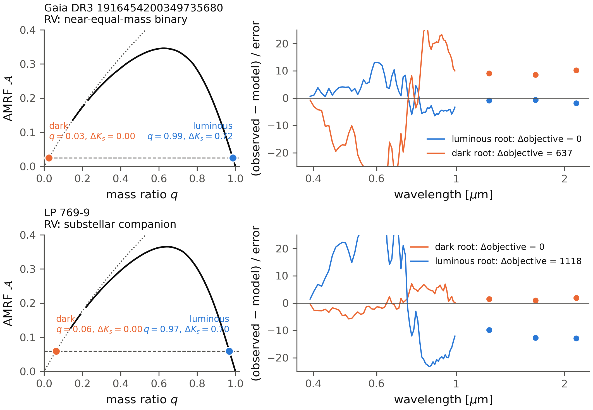
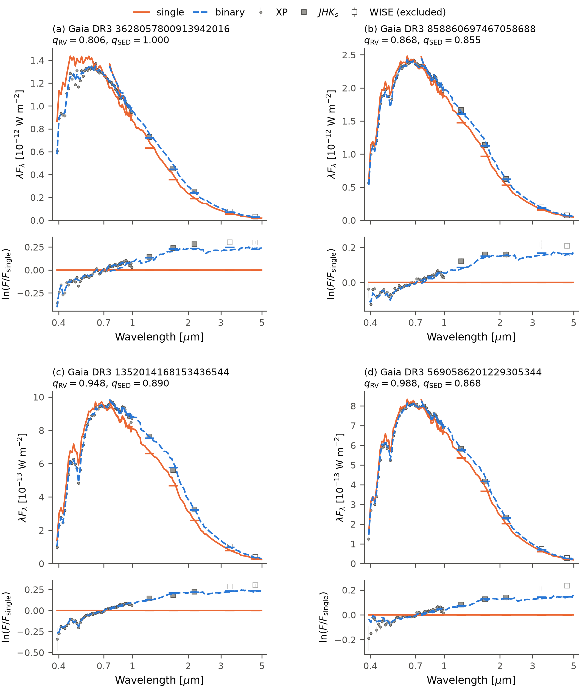
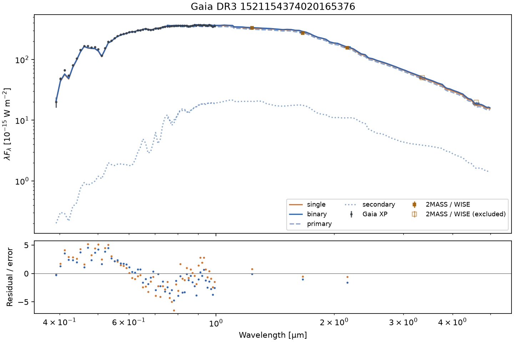

# sedkit

Download and fit stellar spectral energy distributions.

sedkit combines public Gaia DR3 XP spectra with Gaia-linked 2MASS and
AllWISE photometry. A compact empirical stellar model predicts absolute
fluxes for a single star or a coeval binary, and tells whether a Gaia
astrometric orbit comes from a faint companion or a hidden near-equal-mass
twin. The package runs on NumPy and
SciPy, with no J-CAPS installation, JAX, GPU or separate model download.

## Install

```bash
pip install "sedkit[download] @ git+https://github.com/jiadonglee/sedkit.git"
```

For a local checkout, use `pip install -e ".[download]"`. Plain
`pip install .` supports offline fitting and plotting. Notebooks additionally
need Jupyter: `pip install -e ".[download,notebook]"`. For optional SPHEREx
acquisition, add the `spherex` extra; see [SPHEREx downloads](docs/spherex.md).

## One source

```python
from sedkit import download, fit, plot

sed = download("1521154374020165376", cache_dir="data")
result = fit(sed, age_gyr=5.0, feh=0.0)
print(result["binary"]["m1"], result["binary"]["q"])
fig = plot(sed, result, path="sed.png")
```

This example fixes age and metallicity. Use `age_gyr=None, feh=None` to fit
them. Use `kind="single"`, `kind="binary"`, or the default `kind="both"`;
`q=0.7` fixes the binary mass ratio. `result["delta"]` is the single minus
binary objective, including the shared parallax constraint. It is a model
preference diagnostic, not a binary probability.

Coordinates are also accepted: `download(ra=..., dec=...)`, in ICRS degrees
at Gaia's reference epoch. Coordinate lookup requires exactly one Gaia
match within 2 arcsec. Source IDs avoid coordinate-epoch ambiguity.

## Is a Gaia substellar candidate a hidden twin?

A Gaia photocentre orbit fixes a combination of mass ratio and flux ratio,
not the mass ratio. The same small orbit is made by a brown dwarf or by a
near-equal-mass star whose light cancels the photocentre motion.
`sedkit.orbit` returns both solutions, the brightening each predicts, and
which one the observed SED prefers:

```python
from sedkit import download
from sedkit.orbit import solve_orbit, rank_roots
roots = solve_orbit(a0_mas=0.6978, parallax_mas=13.913, period_day=339.57, m1=0.686)
ranked = rank_roots(download("5148853253106611200"), roots, parallax_mas=13.913)
print([(r["kind"], round(r["q"], 2), round(r["delta"])) for r in ranked])
# [('dark', 0.06, 0), ('luminous', 0.97, 1118)]
```

On two Gaia DR3 substellar candidates with radial-velocity follow-up, XP and
2MASS alone choose the luminous solution for the binary and the dark one for
the star with a confirmed substellar companion
([details](docs/orbit.md)).



## Examples and interfaces

- [Quickstart notebook](examples/quickstart.ipynb): download, fit, plot and reuse.
- [Three group-meeting notebooks](docs/group-meeting.md): observed SEDs, SPHEREx and orblet.
- [Offline mock](examples/mock.py): a reproducible coeval binary experiment.
- [Public source example](examples/real_source.py): an observed SED and residuals.
- [Four real SB2 systems](docs/sb2.md): SED fits compared with RV mass ratios.
- [SPHEREx downloads](docs/spherex.md): append QR2 spectra or import XphereX results.
- [API](docs/api.md): observations, predictions and fitting options.
- [Model and limitations](docs/model.md): physical assumptions and support.
- [Data and provenance](docs/data.md): units, quality masks and cache products.
- [orblet interface](docs/orblet.md): composable likelihood and tested joint mock.
- [Observed joint fit](docs/real-orblet.md): HD 195987 XP and double-lined RVs.
- [Photocentre orbits](docs/orbit.md): faint companion or hidden twin.
- [Validation](docs/validation.md): installation and example checks.

An offline snapshot of the public source is included:

```python
from sedkit import SED
sed = SED.load("examples/gaia_dr3_1521154374020165376.npz")
```



The SB2 examples fit age and metallicity. All four prefer the binary model,
but SED mass ratios do not agree uniformly with the independent RV values.
See the [experiment](docs/sb2.md) for the comparison and limitations.



The example fixes age and metallicity. Its binary fit reaches the parallax
constraint boundary and retains structured XP residuals; the figure
demonstrates the workflow, rather than confirming a companion.

## Development

```bash
pip install -e ".[test]"
pytest -q
```

## Credits

The bundled empirical model is extracted from
[J-CAPS](https://github.com/jiadonglee/J-Caps), using PARSEC stellar tracks.
Public XP spectra are calibrated with
[GaiaXPy](https://gaia-dpci.github.io/GaiaXPy-website/).
SPHEREx aperture extraction uses [XphereX](https://github.com/jiadonglee/XphereX),
[TallTable](https://github.com/cmhainje/talltable) and
[SPExPI](https://github.com/fkiwy/spexpi).
Catalogue data are retrieved through
[astroquery](https://astroquery.readthedocs.io/en/latest/gaia/gaia.html).
Please acknowledge Gaia, 2MASS, WISE, PARSEC and J-CAPS when using these
data and models in research; see [provenance](docs/data.md).
