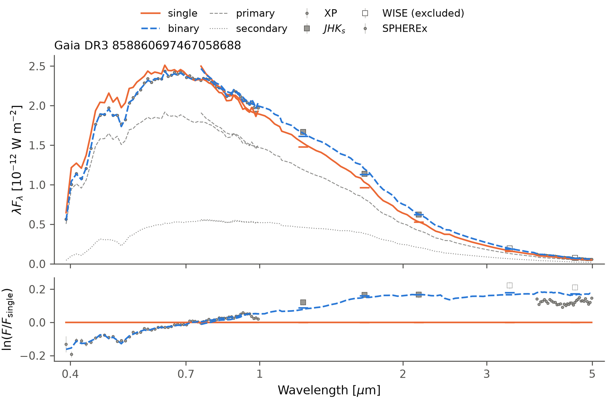

# Download SPHEREx spectra

`download_spherex` queries TallTable pixels and runs the aperture extraction
from [XphereX](https://github.com/jiadonglee/XphereX), using SPExPI calibration
and official QR2 spectral channels. It returns a copy of the input SED with
SPHEREx measurements attached. No XphereX checkout is needed.

## Install and run

```bash
pip install "sedkit[download,spherex] @ git+https://github.com/jiadonglee/sedkit.git"
```

```python
from sedkit import download, download_spherex, fit, plot

sed = download("858860697467058688", cache_dir="data")
sed = download_spherex(sed, cache_dir="data")
result = fit(sed, age_gyr=None, feh=None)
fig = plot(sed, result, path="xp_spherex.png")
```

The optional extra installs uv. On the first call, uv obtains Python 3.12
and the isolated TallTable/SPExPI dependencies; this can take several minutes
and requires network access, Git and disk space. Offline SED fitting remains
on NumPy/SciPy. The worker pins the same TallTable and SPExPI revisions as
XphereX revision `b313934d84fea9221c9607ba70f259c025faf660`.

## Cache and measurements

`download_spherex(sed, cache_dir="data", refresh=False, radius_arcmin=0.8)`
uses `ra`, `dec`, `pmra`, `pmdec` and `ref_epoch` from the Gaia SED metadata.
The query centre is propagated to epoch 2025.5. Aperture radius is 2 pixels,
with a background annulus spanning 4--6 pixels. Existing spectra are reused;
`refresh=True` fetches pixels and extracts the source again. Use refresh
when changing the query radius.

`cache_dir/spherex/source_id/` contains the queried `pixels.parquet`, all
measured `aperture_exposures.csv`, the binned `aperture_spectrum.csv`, extraction
`metadata.json` and a combined `sed.npz`. Calibration files are shared under
`cache_dir/spherex/calibration_cache/`.

A measured exposure enters binning only when its aperture contains no fatal
SPExPI flag bits and its unmasked area equals the full circular aperture.
Partial apertures lose source light; their raw measurements are retained
with `valid=False`, area and flag counts. Missing spectral channels remain
NaN and masked. Fluxes and errors are converted from Jy to the SED's physical
F_lambda units at the source's distance. No interpolation, flux normalization,
zero-point correction or uncertainty rescaling is applied.

## Import an existing XphereX result

```python
from sedkit import load_spherex
sed = load_spherex(sed, "path/to/psf_spectrum.csv", method="psf")
```

This accepts aperture or PSF CSVs with `wavelength_um`, `flux_jy`, `error_jy`.
Rows must identify unique channels on the bundled 102-channel grid, within
1e-6 um. Subsets are accepted; this is channel assignment, not interpolation.
Import trusts the upstream extraction quality, retaining finite measurements
with positive errors. New PSF extraction runs in XphereX; sedkit downloads
through its aperture route.

## Observed example and limitations

[run.py](../examples/spherex_20260927/run.py) reproduces the included observed
example offline. `python examples/spherex_20260927/run.py --download` invokes
the downloader and writes cached products before fitting.

For Gaia DR3 858860697467058688, 66,662 pixels yield 307 measured exposures.
80 have complete, unflagged apertures, providing 34 valid channels. Together
with XP+JHKs this gives 98 fitted channels and q=0.829, versus RV q=0.868.
The age reaches 10 Gyr; this example does not establish mass accuracy.



Aperture fluxes are not corrected for PSF encircled energy. The source centre
is fixed at the propagated query epoch, without per-exposure motion tracking
or neighbour deblending. These limitations matter for fast-moving sources,
crowded fields and incomplete apertures. Quality selection can leave little
wavelength coverage. G<9 excludes SPHEREx during fitting as described in
[data](data.md); uncertainties and calibration accuracy remain properties of
the upstream measurements, not guarantees of the downloader.
