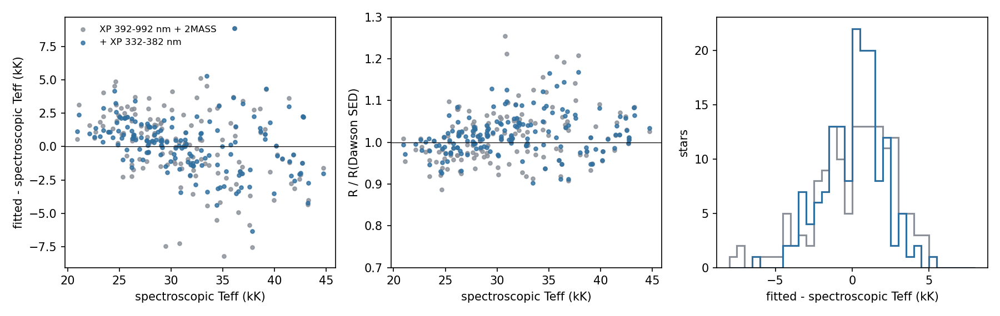
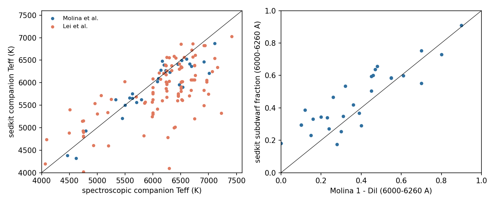
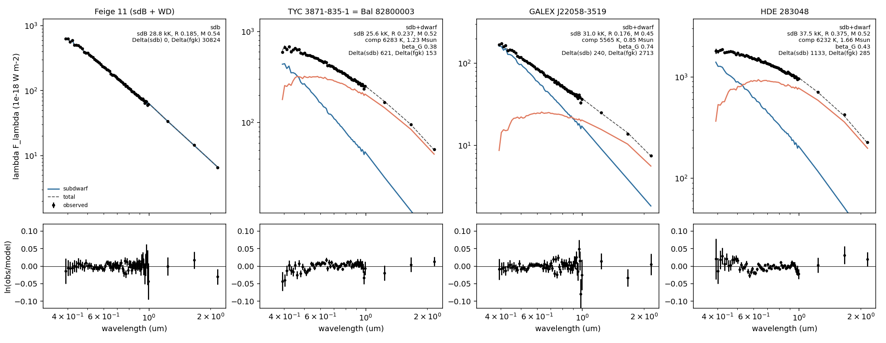
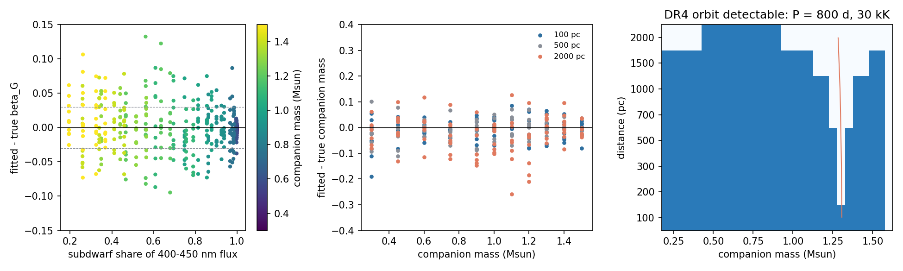

# Hot-subdwarf validation

`fit_subdwarf_companion` and the subdwarf orbit functions
([model](model.md#subdwarf-route), [orbits](orbit.md#luminous-companions-of-a-different-kind))
are tested on six questions. The run scripts, catalogues and outputs are in
the run directory `subdwarf_validation_20261009` (local copy
`~/Project/data/subdwarf_validation`, Garching
`/home/jdli/nexus/sedkit_subdwarf_20261009`).

## Criteria

Fixed before the runs:

| Item | Test | Pass |
| --- | --- | --- |
| 1 | single subdwarfs: Teff against spectroscopy, R against SED radii | median Teff offset <= 1 kK with its scatter reported; median R / R_Dawson within 1 +- 0.1 |
| 2 | subdwarfs with compact companions | the composite hypothesis is not selected; the companion limit agrees with the blackbody decomposition |
| 3 | composites with spectroscopic companions | companion Teff offset and scatter, [M/H] offset reported; M_sdB = q M_MS reported |
| 4 | light fractions against three external scales | differences reported at the same wavelengths |
| 5 | DR3 orbits of two composites | M_sdB from a0, parallax, P and the SED beta_G compared with the dynamical value |
| 6 | injections, false positives, DR4 detectability | per companion regime, below |

For item 6 the regimes and criteria are:

- **sdB + K/M (M_c <~ 0.9):** the companion mass scatter is at most
  0.1 solar masses.
- **sdB + G (0.9--1.1):** the light-fraction error delta beta_G is at most
  0.03, so that delta M_sdB <= 0.07 with dM_sdB/dbeta ~ 2.3--2.6.
  If this fails, the M_sdB distribution is restricted to the K/M regime
  and the RV subsample.
- **sdB + F (1.2--1.5):** B ~ beta_G, and the photocentre orbit is small
  or absent; M_sdB needs the companion's RV orbit. This regime is
  reported, not graded.

The false-positive rate is the fraction of RV-constant FGK dwarfs whose
detection statistic exceeds the threshold, by G magnitude.

## 1. Single subdwarfs

**Sample.** Dawson et al. (2026, J/A+A/707/A6) give spectroscopic Teff,
log g and helium abundance and SED radii for the hot subdwarfs within
500 pc. Of the 217 stars with quality A atmospheric and SED parameters in
Teff 20--45 kK and log g 5--6.5, 213 match Gaia DR3 within 1.5 arcsec at
epoch J2000; the 172 of class sdB, sdOB, sdO, iHe-sdOB, eHe-sdO and sdBV
(no companion in the class) form the sample, and 157 of them have XP and a
supported tier. The tier follows the spectroscopic log(He/H): `H` below
-1.5, `mid` up to -0.6, `He` above (the last two from 32 kK).

**Fit.** Each star is fitted with `companions=()`, its tier, a Gaussian
prior on its spectroscopic log g (width 0.1), Teff free, Edenhofer E and the
parallax fitted. The subdwarf correction is fitted in five folds by
source_id and each star is fitted with the correction of the other four
folds (out of fold).

| Data | Stars | Median Teff - Teff_spec | Robust scatter | Median R / R_Dawson | Robust scatter | XP rms |
| --- | ---: | ---: | ---: | ---: | ---: | ---: |
| XP 392--992 nm + 2MASS | 157 | +0.51 kK | 2.60 kK | 1.011 | 0.058 | 1.31% |
| + XP 332--382 nm | 157 | +0.38 kK | 1.72 kK | 1.013 | 0.041 | 1.33% |

Both pass: the median Teff offset is below 1 kK and the median radius ratio
within 1 +- 0.1. By spectroscopic Teff, with the blue channels:

| Teff_spec (kK) | Stars | Teff offset | Scatter | R / R_Dawson |
| --- | ---: | ---: | ---: | ---: |
| 20--28 | 53 | +1.08 kK | 0.97 kK | 0.997 |
| 28--32 | 39 | +0.11 kK | 1.02 kK | 1.022 |
| 32--36 | 27 | -0.86 kK | 2.20 kK | 1.041 |
| 36--45 | 38 | -1.01 kK | 2.94 kK | 1.015 |

The fitted Teff is compressed towards 30 kK: in the Rayleigh--Jeans tail XP
and 2MASS weakly separate Teff from E, and the Edenhofer prior and the
table edges pull the solution inwards. Below 28 kK the offset, +1.1 kK,
exceeds the 1 kK criterion in that bin. The helium tiers hold few stars
(8 `mid`, 12 `He`). Masses g R^2 / G at the spectroscopic log g are
1.05 +- 0.11 times Dawson's SED masses. 59--62 per cent of the stars lie
within their Teff profile range combined with the 1.05 kK scale difference
below, against 68 per cent for a one-sigma interval.

**The spectroscopic scale.** For the 52 stars in both Dawson et al. and
Luo et al. (2021), Dawson's Teff lie 1.05 kK below Luo's, with 1.07 kK
scatter. The correction is fitted on Dawson's scale, and so are sedkit Teff:
44 faint Luo subdwarfs (the GALEX sample below) fit 1.3 kK under Luo's
Teff. A spectroscopic
Teff prior needs to be on this scale (see item 2).

**The correction.** At their spectroscopic labels the 157 anchors leave a
common XP residual after the hot-table correction; at the median Balmer
index the fitted correction is -4.6 per cent at 392 nm, -4.3 per cent at
662 nm (H-alpha), +5.8 per cent at 992 nm and 1.1 per cent (median
absolute) over XP. About it the per-star scatter is 0.5--1.4 per cent over
450--900 nm and 1.7--3.8 per cent in the two outer channels at each XP
edge. In a first pass on 76--84 of these stars with the Stilism E of
Dawson et al. as the extinction prior, the fits gave Teff +3.8 kK above
spectroscopy and 5.5 per cent XP rms without any correction, +3.2 kK and
2.8 per cent with the hot-table offset alone, and +0.8 kK and 2.3 per cent
with its Balmer term; the subdwarf correction removes the rest of the common
residual. Median chi2/N of the out-of-fold fits is 0.78.

**XP below 392 nm.** The six channels at 332--382 nm carry the Balmer
jump. Their correction at the median Balmer index is -65 per cent at
332 nm, where the forward model fails, and -15 to +9 per cent at
342--382 nm, with 2.8--3.9 per cent per-star scatter about it at
342--382 nm. With them the Teff scatter of single subdwarfs falls from 2.6
to 1.7 kK and the radius scatter from 5.8 to 4.1 per cent, without moving
the median.

**GALEX.** Only 4 of 165 Dawson stars are fainter than the NUV roll-off.
GALEX is tested on 80 Luo subdwarfs with G = 15--16.5 (log(He/H) < -1.5,
parallax SNR >= 5, RUWE < 1.4), 44 of them with a usable band. On these 44,
adding GALEX moves the fitted Teff from 1.3 to 6.5 kK below Luo's Teff; the
FUV flux lies 9 per cent below the model (scatter 10 per cent), NUV
3 per cent above. The pure-hydrogen atmospheres have no metal line
blanketing, which depresses the FUV of real subdwarfs. GALEX therefore
stays out of the validated fit.

## 2. Compact and faint companions

**Samples.** (a) 22 bright Luo subdwarfs whose blackbody decomposition in
the prestudy found no infrared excess in XP, 2MASS, WISE and SPHEREx; five
of them have a compact-companion RV orbit (Lan 11, Feige 11 and three
others), the other 17 are RV-variable or constant. Two are also calibration
anchors. (b) Dawson's 20 sdB+WD and 23 sdB+dM systems in the table box.

**Fit.** As item 1, with `companions=("dwarf",)` and the default data (XP
and J/H/Ks), then the subdwarf + dwarf objective at fixed companion masses
0.10--0.80 (5 Gyr, solar [M/H]); the mass limit is the largest mass within
9 of the single-subdwarf objective. The same fits with the prestudy's
SPHEREx spectra are the variant discussed below the table.

**Results, default data (no SPHEREx), Teff free:**

| Group | Stars | Median Delta | Max Delta | Delta > 9 | Mass limit (5 Gyr dwarf) |
| --- | ---: | ---: | ---: | ---: | --- |
| compact RV orbit | 5 | -1.1 | 2.8 | 0 | 0.20--0.45 |
| no infrared excess | 15 | -1.7 | 22.5 | 1 | 0.12--0.80 |
| Dawson sdB+WD | 16 | -1.5 | -0.5 | 0 | 0.12--0.30 |
| Dawson sdB+dM | 20 | +1.1 | 33.8 | 3 | 0.20--0.45 |

Delta is the single-subdwarf objective minus the composite objective; the
composite is not selected for any system with a compact companion. The one
no-excess star above 9, J150109.02+412135.5 (Delta = 22.5), takes a
1.1 solar-mass F companion from XP and 2MASS; it is an RV-variable star
(K ~ 7 km/s) and its SPHEREx spectrum rejects that companion. Three of the
sdB+dM systems prefer a cool companion, as an M dwarf can.

**SPHEREx.** With the QR2 aperture spectra of the prestudy, the mass limits
tighten to 0.10--0.30 solar masses, and two to three of the 15 no-excess
stars reach Delta = 9--68 with a 0.2 solar-mass, 2800 K companion; without
SPHEREx the same stars give Delta <= 0. The blackbody screen of the
prestudy, with a 3 per cent floor, had found Delta chi2 = 8--11 for two of
them. SPHEREx is therefore off by default in `fit_subdwarf_companion`.

**Against the blackbody limits.** The prestudy's 3-sigma limits on a 3500 K
blackbody companion are R < 0.04--0.17 Rsun (0.49 for J150109). A 3500 K
dwarf (about 0.37 solar masses, R = 0.36 Rsun at 5 Gyr) is excluded by the
sedkit limit for 16 of the 20 prestudy stars without SPHEREx and for all but
J150109 with it, as by the blackbody fits. The sedkit limits are weaker
in radius: the subdwarf's Teff is free here, where the blackbody fits fixed
it at the spectroscopic value.

**A spectroscopic Teff prior.** With Luo's Teff as a prior (width 1 kK)
and SPHEREx, five to six of the 15 no-excess stars reach Delta > 9 whether
or not the 1.05 kK scale offset is removed; the prior holds the subdwarf's
slope fixed, and the companion absorbs the SPHEREx mismatch.

## 3. Composites with spectroscopic companions

**Samples.** Molina et al. (2026, J/A+A/710/A280): 32 double-lined wide
sdB binaries with RV orbits (q = M_sdB / M_MS from K_MS / K_sdB), GSSP
Teff and [M/H] of the companion and its share of the light at
6000--6260 A, plus 13 systems with Gaia orbits; 42 have XP. Lei et al.
(2023, J/ApJ/942/109): 131 LAMOST composites with Teff and log g of both
stars, 111 with XP. Each is fitted with companions `("dwarf",
"subgiant")`, no companion prior, the subdwarf's log g (Lei, width 0.2;
otherwise 5.6 +- 0.3), the tier from Lei's helium abundance or all tiers,
Edenhofer E and the parallax fitted.

| Sample | Composite preferred | Companion Teff, fit - spec | [M/H], fit - spec (dwarf fits) | Subdwarf Teff, fit - spec |
| --- | --- | --- | --- | --- |
| Molina | 42 / 42 (37 dwarf) | -54 K, scatter 268 K (29) | +0.27, scatter 0.28 (25) | |
| Lei | 107 / 111 (98 dwarf) | -356 K, scatter 570 K (111) | +0.55, scatter 0.41 (102) | -2.0 kK, scatter 5.6 kK |

The companion Teff agrees with GSSP to 50 K with 270 K scatter. The SED
metallicity runs 0.3 dex above GSSP and 0.55 dex above the LAMOST
composite analysis; the [M/H] of the companion is constrained mainly by the
network's response to colour, which the subdwarf's light dilutes, and is
not a spectroscopic measurement. For the 25 Molina systems with a dwarf
companion, M_sdB = q M_MS is 0.517 solar masses (16--84 per cent
0.44--0.64).

**XP below 392 nm in composites.** Fitted again with the six blue
channels, the same systems shift: the subdwarf 1.1 kK cooler (scatter
3.3 kK), the companion 30--80 K cooler, beta_G 0.012 higher (scatter
0.019), and sedkit minus (1 - Dil) from +0.06 to +0.11. The companion's
flux below 392 nm is a blackbody joined to its 392--412 nm flux, which
overstates an F or G star below the Balmer jump. The blue channels are
therefore validated for single subdwarfs (item 1) and not for composites.

## 4. Light fractions against external scales

The subdwarf's share of the light at the wavelengths of each external
measurement, from the item-3 fits:

| System | sedkit beta_G | Vos et al. SED beta_G | Prestudy XP beta_G | 6720--6800 A: sedkit / XTgrid | MRS blue: sedkit / dilution | MRS red: sedkit / dilution | 6000--6260 A: sedkit / Molina |
| --- | --- | --- | --- | --- | --- | --- | --- |
| BD+34 1543 | 0.34 | 0.29--0.39 | 0.41 (0.35--0.48) | 0.25 / 0.57 | 0.40 / 0.38 | 0.26 / 0.14 | 0.29 / 0.40 |
| BD+29 3070 | 0.30 | 0.33--0.41 | 0.28 (0.22--0.33) | 0.22 / 0.58 | 0.34 / 0.41 | 0.23 / 0.31 | 0.25 / 0.30 |
| TYC 3871-835-1 (Bal 82800003) | 0.41 (0.37--0.44) | | 0.31 (0.26--0.36) | | 0.48 / 0.32 | 0.33 / -0.07 | 0.37 / 0.39 |
| HDE 283048 | 0.44 | | 0.33 (0.28--0.63) | | 0.53 / 0.43 | 0.37 / 0.20 | |

Ranges are the Teff-profile ranges (sedkit) and the spread of the prestudy's
six decomposition routes; the line-dilution fractions carry +-0.15 (blue)
and +-0.25 (red) per star. sedkit agrees with the SED scales of Vos et al.
and the prestudy to 0.11 and with the blue-arm dilution to 0.02--0.16; at
6720--6800 A it is 0.32 and 0.36 below the XTgrid decomposition of
Vos et al. For all 29 Molina systems with XP, sedkit minus (1 - Dil) at
6000--6260 A is +0.06 with 0.13 scatter. For TYC 3871-835-1 the fitted
subdwarf is cool and large (23.5 kK, 1.3 solar masses at log g 5.6);
without the subdwarf correction the fit gives 32 kK and beta_G = 0.34, and
with a mass prior of 0.47 +- 0.1, 25.6 kK and 0.38: the subdwarf's Teff in
a composite moves beta_G by up to 0.08.

Fits of Feige 11 (sdB + white dwarf, preferred as a single subdwarf),
TYC 3871-835-1, GALEX J22058-3519 and HDE 283048 with `companions=
("dwarf",)`, Edenhofer E and the parallax fitted; the subdwarf (blue), the
companion (coral) and their sum (dashed) of the preferred hypothesis, with
ln(observed / model) below. TYC 3871-835-1 and HDE 283048 carry a subdwarf
mass prior of 0.47 +- 0.1 in addition to log g 5.6 +- 0.3.

## 5. Photocentre orbits

GALEX J22058-3519 and EC 11383-2238 are the two composites with a Gaia DR3
two-body orbit. Molina et al. list their companions' GSSP parameters
(5914 +- 294 K, [M/H] = -0.57, Dil = 0.43; 5669 +- 204 K, -0.03, 0.68)
but no q or K: their RV orbits are part of an ongoing programme. The
comparison of M_sdB from a0 with M_sdB from q and K therefore waits for
those orbits. The test made instead combines the DR3 orbit, the NSS
parallax and the SED:

| System | a0 (mas) | i | SED M_c | SED beta_G | M_sdB, B < beta | M_sdB, B > beta | beta for M_sdB = 0.47 | 6000--6260 A: sedkit / Molina |
| --- | --- | --- | --- | --- | --- | --- | --- | --- |
| GALEX J22058-3519 | 0.83 +- 0.15 | 28 deg | 0.85 | 0.74 | 0.59 +- 0.22 | 9.4 | 0.70 | 0.70 / 0.57 |
| EC 11383-2238 | 0.45 +- 0.16 | 131 deg | 1.02 | 0.56 | 0.51 +- 0.22 | 2.8 | 0.55 | 0.52 / 0.32 |

a0 and i follow from the Thiele--Innes elements; the a0 error is the mean
of the A, B, F, G errors. sigma(M_sdB) adds in quadrature the effects of
a0, parallax, M_c (+-0.1) and beta_G (+-0.03), and is dominated by a0.
Both orbits have one physical branch, with the photocentre on the subdwarf
(B < beta_G), and M_sdB within 1 sigma of 0.47. Read the other way, a
0.47 solar-mass subdwarf requires beta_G = 0.70 and 0.55 (+-0.06 and
+-0.08 from a0), within 0.04 of the SED values. In the SED fits the
6000--6260 A share lies 0.04 below beta_G for both stars; with that offset
Molina's dilution (subdwarf shares 0.57 and 0.32 at 6000--6260 A)
corresponds to beta_G ~ 0.61 and 0.36, 1.4 and 2.3 sigma below the
orbit-implied values. Two systems, a canonical subdwarf mass and the SED
companion mass make this an indication, not a calibration.

For TYC 3871-835-1 (Bal 82800003) Molina's q = 0.545 and the SED companion
mass (1.22 solar masses) give M_sdB = 0.66 and B = 0.35: with the SED
beta_G = 0.41 a DR4 orbit would have a0 = 0.37 mas on the B < beta branch,
and 0.90 mas if the subdwarf gave half the G light. For HDE 283048, a
0.47 solar-mass subdwarf and the SED companion (1.61 solar masses, R =
2.9 Rsun) predict a0 = 1.28 mas (1.62 mas for beta_G = 0.5). The LAMOST
orbits of the cool stars (P = 1379 and 1022 d, K = 3.2 and 2.3 km/s) fix
B once DR4 gives the inclination.

## 6. Injections, false positives and DR4 detectability

**Injections.** 744 composites of a TMAP subdwarf (log g 5.6, the radius of
0.47 solar masses, Teff 25--40 kK) and a PARSEC dwarf (0.3--1.5 solar
masses, 2 Gyr, solar [M/H]) at 0.1--2 kpc, E = 0.01 + 0.1 per kpc. Each is
observed with the fractional XP, 2MASS and WISE errors and mask of the real
SED nearest in G (Dawson, Molina, Lei and the controls below), with
Gaussian noise of those errors. Model mismatch is real: the subdwarf
carries the post-correction residual of a random calibration anchor, the
companion one draw of its network model-error covariance. The fit uses
companions `("dwarf",)`, a subdwarf log g prior 5.6 +- 0.2, an E prior of
width 0.03 and the parallax fitted with a Gaia-like error. Variants:
nominal (tier `H` fitted, two noise draws), tiers free, a `mid`-tier
subdwarf fitted with tier `H`, and an E prior centred 0.03 high. The
subdwarf supplies 20--100 per cent of the 400--450 nm light; shares below
20 per cent need companions hotter than the network's 7498 K.

| Regime | Variant | Systems | beta_G bias / scatter | M_c bias / scatter |
| --- | --- | ---: | --- | --- |
| K/M (0.3--0.75) | nominal | 158 | 0.000 / 0.005 | -0.013 / 0.038 |
| K/M | tiers free | 79 | -0.001 / 0.004 | -0.004 / 0.038 |
| G (0.9--1.1) | nominal | 120 | -0.004 / 0.031 | -0.007 / 0.058 |
| G | tiers free | 60 | +0.002 / 0.025 | -0.013 / 0.083 |
| G | E prior +0.03 | 12 | +0.016 / 0.031 | -0.013 / 0.059 |
| F (1.2--1.5) | nominal | 160 | +0.003 / 0.038 | -0.002 / 0.036 |
| F | E prior +0.03 | 16 | +0.023 / 0.039 | +0.007 / 0.034 |

The helium mismatch moves beta_G by less than 0.01. The subdwarf's own
Teff is not recovered in composites (robust scatter 4--10 kK, radius
10--30 per cent): with an E prior of width 0.03 neither XP nor 2MASS fixes
the temperature of a hot star, even when it dominates the light.

**M_sdB through the orbit.** For each injection, an orbit of P = 800 d gives
a0 = a |B - beta_G| from the true masses and beta_G, observed with the
sigma_a0 of the detectability map below; `solve_luminous_pair` returns
M_sdB on both branches from the fitted M_c and beta_G.

| Regime | Detected | M_sdB bias / scatter, true branch | Other branch also 0.3--0.8 | Companion 0.1 below its isochrone mass |
| --- | ---: | --- | ---: | --- |
| K/M | 219 / 237 | -0.025 / 0.090 | 0 | +0.182 / 0.122 |
| G | 162 / 180 | -0.020 / 0.096 | 2 | +0.071 / 0.103 |
| F | 153 / 240 | -0.002 / 0.088 | 33 | +0.035 / 0.100 |

For K/M companions the orbit is used the other way: with M_sdB = 0.47 +-
0.05 as a prior and the SED beta, `solve_dark_companion` returns the
companion's dynamical mass with bias +0.005 and scatter 0.043 (237
systems), and +0.004 / 0.049 when the isochrone mass is 0.1 too high.

**Against the criteria.** K/M passes: the companion mass scatters by
0.04 solar masses from the SED and from the orbit. G fails narrowly:
delta beta_G = 0.025--0.031 against 0.03, and M_sdB scatters by
0.096 against 0.07; a companion 0.1 solar masses lighter than its
isochrone adds +0.07. The M_sdB distribution is therefore restricted to the
K/M regime and the RV subsample. In the F regime M_sdB scatters by 0.09
where an orbit is seen, and in 33 of 153 detected systems the wrong branch
also gives a subdwarf-like mass.

**False positives.** 254 APOGEE DR17 dwarfs at 6000--7500 K with
log g > 3.9, at least three visits with VSCATTER < 0.5 km/s, one RV
component, parallax SNR > 10 within 1.2 kpc and G = 9--16, stratified in G
and SFD E(B-V) (230 with XP), are fitted like a Gaia-only target:
companions `("dwarf",)`, all tiers, subdwarf log g 5.6 +- 0.3, Edenhofer E,
parallax fitted. The detection statistic is the lower of the single-FGK
and single-subdwarf objectives minus the composite one.

| Criterion | False positives | sdB share 400--450 nm: < 0.3 | 0.3--0.5 | 0.5--0.8 | 0.8--0.95 | > 0.95 |
| --- | ---: | ---: | ---: | ---: | ---: | ---: |
| Delta > 25 | 11 / 230 | 0.20 | 0.80 | 0.99 | 1.00 | 0.69 |
| Delta > 25 and beta_G > 0.2 | 0 / 230 | 0.07 | 0.66 | 0.99 | 1.00 | 0.69 |

The detection fractions are those of the nominal injections. All 11
controls above 25 have a small composite beta_G (0.002--0.18), and eight lie
behind SFD E(B-V) = 0.7--2.0: the fit adds a faint hot star to absorb a
reddening or model mismatch. With the beta_G > 0.2 requirement none of the controls is
flagged in any G bin (9--10: 27 stars, 10--11: 26, 11--12: 49, 12--13: 50,
13--14: 46, 14--15: 30, 15--16: 2); the threshold was chosen on these
controls, so this is a development sample, and 0/230 bounds the rate below
1.3 per cent (95 per cent). For a K/M companion (share > 0.95) the
statistic tests the companion against a single subdwarf, not the subdwarf
against an FGK star, which the fit separates in 91 per cent of all
injections at Delta > 25.

**DR4 detectability** (`v6_completeness.py`). For a 30 kK subdwarf with a
dwarf companion, a = parallax (M_tot P^2)^(1/3) and a0 = a |B - beta_G| are
compared with sigma_a0 = 1.5 sigma_fov(G) sqrt(2/90), sigma_fov = 0.07 mas
plus 0.07 mas at G = 13 scaling as photon noise (0.10 mas at G = 13,
0.19 mas at G = 15), 90 transits; an orbit counts as detected at
a0/sigma_a0 >= 5 with P <= 2000 d and outside 325--405 d. These are
assumptions of the map, not a DR4 simulation. B = beta_G at M_c = 1.30
solar masses: there no orbit is seen at any distance, and for
1.25--1.35 solar masses only within 500 pc at P = 800 d. K/M companions are
detected to 1.5--2 kpc. Over the grid of 0.2--1.55 solar masses and
0.1--2 kpc, 82 per cent of systems are detectable at P = 800 d and
88 per cent at 1600 d, none at 365 d.

## Limitations

- The Teff scale is that of Dawson et al. (2026), 1.05 kK below Luo et al.
  (2021); a spectroscopic Teff prior from another analysis needs that
  offset. Fitted Teff are compressed towards 30 kK (+1.1 kK below 28 kK,
  -1.0 kK above 36 kK), and the profile ranges cover 59--62 per cent of the
  stars where 68 per cent is expected.
- The helium tiers rest on 8 (`mid`) and 12 (`He`) calibration stars, and
  He-rich subdwarfs below 32 kK are outside the table. The pure-hydrogen
  tier carries no metals: GALEX FUV lies 9 per cent below it, and GALEX
  pulls Teff 5 kK low, so GALEX is not used by default.
- In composites the subdwarf's Teff and radius are poorly determined
  (4--10 kK, 10--30 per cent in injections) and move beta_G by up to 0.08
  on real data; the companion's [M/H] runs 0.3--0.6 dex high. The blue XP
  channels bias composites and SPHEREx QR2 aperture spectra create spurious
  infrared excess; both are off for composites.
- For G companions beta_G scatters by 0.025--0.031 and M_sdB through an
  orbit by 0.10, outside the 0.03 / 0.07 criteria; an E prior 0.03 too high
  adds +0.02 to beta_G, and a companion 0.1 solar masses below its
  isochrone mass adds +0.07 to M_sdB.
- The false-positive threshold (Delta > 25, beta_G > 0.2) was set on the
  same 230 controls it is quoted for; the DR4 detectability map assumes a
  per-transit precision and a detection rule, not a DR4 simulation.
- The calibration anchors are single by Dawson's classification; no
  independent infrared-excess screen was applied to them.
- `ranges` collapses to the best value when the final free fit lies more
  than 1 below every Teff profile node; it is then not an interval.
- The DR3 orbit test rests on two systems, a canonical subdwarf mass and
  the SED companion mass; q and K of those systems are not yet published.
- HW Vir-type close binaries with a reflection effect, the light
  variations of pulsating subdwarfs, white-dwarf and brown-dwarf companions
  as light sources, and triples are not modelled. Fits are constrained best
  fits with profile ranges, not posterior samples or population inference.
