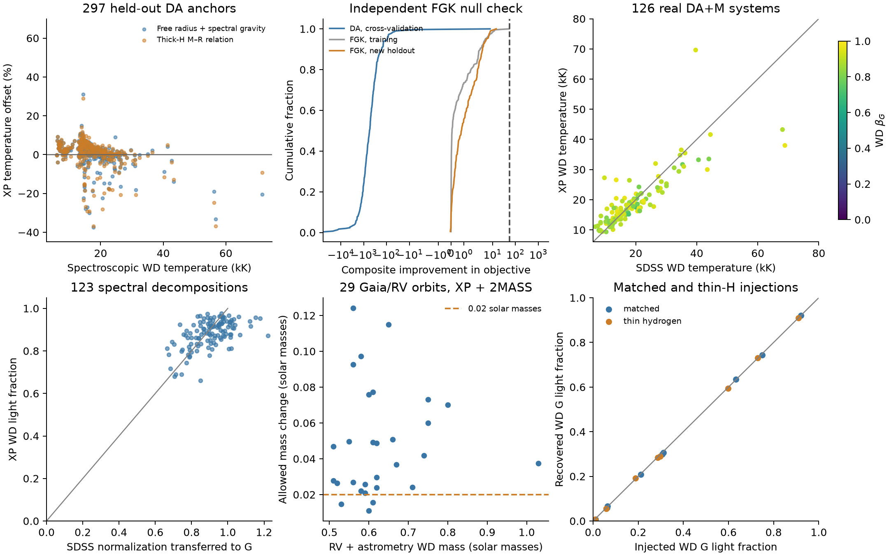

# White-dwarf validation

The DA route measures `beta_G = F_WD/(F_primary+F_WD)` and conditional
light envelopes for photocentre-orbit calculations. Validation below
uses the bundled Koester DA table and Bédard C/O-core cooling tracks.
The criteria were recorded before fitting in the WD plan.

## Anchors and availability

Gaia EDR3 identifiers are joined directly to DR3 `has_xp_continuous`.
SDSS plate/MJD/fibre IDs use the proper-motion-aware crossmatch of
Gentile Fusillo et al. (2021). Brightness does not replace the XP flag:
DR3 contains an additional faint WD selection.

| Reference | Parameter rows | With XP | DA candidates in the model box |
| --- | ---: | ---: | ---: |
| Manser et al. (2024), DESI DA | 1958 | 1043 | 974 |
| Kepler et al. (2021), SDSS DR16 | 555 | 425 | 416 |
| Gianninas et al. (2011), MWDD | 1264 | 1240 | 1210 |
| Kilic et al. (2025), MWDD | 3146 | 3060 | photometric labels |
| Manser et al. (2024), DESI DB | 141 | 65 | outside the DA route |

The spectroscopic DA union has 2524 distinct sources, 2064 with
Teff >= 13 kK or catalogue 3D-corrected labels, and 2005 also passing
RUWE < 1.4 and parallax/error > 10. These counts define availability.
Kilic labels are photometric. SDSS DR16 gravities use a Gaia parallax
constraint and omit 3D corrections; they are excluded from the
independent spectroscopic shape-calibration cohort.

Additional checks find XP for 14852 of 16676 Gentile Fusillo high-probability
(Pwd > .75), parallax > 10 mas candidates, and for all 9786 sources in
the Shahaf non-class-I parent catalogue. The latter includes classes II
and III, rather than exclusively class III or RV-confirmed WDs.
The [updated Shahaf table](https://zenodo.org/records/14799795) uses a
64% red-probability threshold, giving 3145 no-colour-excess candidates;
all have XP. The Nayak et al. (2024) sample is photometrically selected,
not independent XP spectral decomposition, and is not included in the
calibration or measured coverage counts.

The SDSS WDMS comparison uses 478 distinct Gaia IDs matched by spectrum
key to the author catalogue; 170 have XP and 156 have atmospheric labels
within the DA box. The tested subset has 126 exact DA/M classifications,
a reported M subtype and parallax/error > 10. It is not the full SDSS
WDMS population.

## Single DA calibration

The calibration cohort has 297 distinct DESI/Gianninas DA sources within
100 pc and |b| > 30 degrees, with extinction fixed to zero. EC 13198-2849
(LP 911-67), a catalogued double star, is excluded from single-star
calibration. Cool labels use available 3D corrections. Folds are grouped
by source ID. Shape fitting frees the angular scale and removes the grey
normalization; it does not calibrate the cooling-model radius.

The WD-only `exp(a + W b)` correction uses the DA grid's own Balmer
width. Held-out grey-normalized log-shape RMS is 6.21%, compared with
6.53% for a wavelength-only correction. A diagonal fractional error
comes from the training residuals in each fold. The median fitted
spectrum RMS falls from 10.22% with raw spectra to 4.99%.

| Fit | Median Teff offset | Robust scatter |
| --- | ---: | ---: |
| Raw DA, free radius + spectroscopic gravity | +2.78% | 3.52% |
| WD correction, free radius + spectroscopic gravity | +1.06% | 3.46% |
| WD correction plus XP 332--382 nm | +0.80% | 3.68% |
| Default thick-H mass–radius relation | +1.60% | 3.87% |

The free-radius comparison uses a 0.02-dex Gaussian gravity constraint.
The default M–R comparison uses no spectral-label prior. Its mass offset
is +0.028 solar masses with robust scatter 0.044 for 294 sources with
supported reference masses. The reference mass is implied by spectral
Teff/log g and the same cooling tracks; it is not a dynamical mass.
Combined results meet the median-temperature <= 3%, scatter <= 8% and
conditional mass-scatter <= 0.08 criteria.

Temperature-dependent validation is essential: 50, 213 and 27 anchors
lie below 13, at 13--25 and at 25--40 kK. The seven anchors above 40 kK
have a free-radius temperature offset of −13.8% and scatter 9.8%.
The combined result does not establish that precision for hot WDs.
A grouped test of `exp(a+Wb+log(Teff/15000)c)` gives 6.23% shape RMS
and +11.8% temperature bias with 11.7% scatter for the seven hot anchors;
the temperature term does not establish the required hot-WD precision.
Magnitude and temperature bins are in `validation_results.json`.

## Blue XP and GALEX

Blue XP slightly reduces combined temperature bias without reducing
scatter. It stays optional and is not validated as a default for
composites. On the same 71 clean GALEX sources, the XP-only comparison
has +1.12% temperature bias and 2.71% scatter. Uncorrected GALEX gives
−4.21% and 3.61%. A source-grouped UV passband correction gives +0.85%
and 3.14%, using separate constant FUV/NUV factors and empirical errors.
The bundled log corrections are −0.217 and −0.108, with fractional
model-error terms 12.7% and 14.9%.

This UV test covers 6.8--41.4 kK. Matches propagate Gaia positions to
2007 and require proper motion < 80 mas/yr, one candidate within
3 arcsec, no artifact/extraction flags, unsaturated magnitudes and
magnitude errors < 0.2. Epoch uncertainty is then below 0.4 arcsec.
GALEX is not supplied by default.

## Null checks and composite recovery

The tested detection statistic is the better single-star objective
minus the composite objective. A threshold of 55 was fixed as the first
integer above the maximum statistic of 230 APOGEE RV-constant training
controls. Stellar age/metallicity, shared parallax and extinction are
fitted, with a spectroscopic metallicity prior. The independent sample
contains 200 new Gaia IDs, within 150 pc and |b| > 30 degrees, with
4500--7000 K, log g > 4.1, at least five good RVs, RV scatter < 0.3 km/s
and S/N > 100. It shares no IDs with the training sample.

| Sample | Above threshold | One-sided 95% binomial upper bound |
| --- | ---: | ---: |
| Held-out DA folds | 0 / 297 | 1.00% |
| Independent FGK controls | 0 / 200 | 1.49% |

Both meet the 2% control-sample criterion. The reported bound is on the
control-sample candidate rate; RV constancy and a DA classification do
not prove that every control lacks a companion. A threshold calibrated
with XP61 and these nuisance priors is not universal across data sets.

On 126 SDSS DA/M systems, default solar-metallicity, 5-Gyr dwarf fits
give a WD temperature offset of −0.28% and robust scatter 14.89%, meeting
the 15% temperature criterion. Using the Pecaut/Mamajek temperature
scale, inferred M subtype has a +0.68-subclass median offset and
0.97-subclass robust scatter; 74/126 lie within one subclass. A reliable
one-subclass estimate for every companion is not established.
Only 39 systems have an accepted 2MASS band. Adding those data or freeing
WD radius does not improve the full-sample temperature scatter;
the comparison remains available in `validation_wdms.json`. Broadening
the adopted extinction prior from 0.03 to 0.10 E gives 17.67% WD
temperature scatter and 75/126 subtypes within one subclass; it does not
resolve the subtype shortfall.
The tested statistic recovers 68/126 above 55; this is a catalogue-subset
recovery fraction, not population completeness.

For 123 systems with usable SDSS WD decomposition distances, transfer
its WD angular normalization to Gaia G using the DA spectral shape.
The median XP-minus-reference fraction is −0.0214, robust scatter
0.0824, and 56/123 agree within 0.05. The median-bias criterion is met.
Twenty-three normalization estimates exceed unity, showing the uncertainty
and cross-observation systematics of this reference; they remain in the
reported comparison and are not physical WD fractions. This normalization
is independent of Gaia parallax but shares a DA atmosphere family;
it is not independent atmospheric-model validation.
Observed XP covers all but 0.37% of the G-passband weight.

## Orbits and injections

The Yamaguchi et al. (2024) sample contains 31 XP sources. Two Gaia
orbits, J1834+1525 and J1922-4624, disagree with follow-up RVs in the
paper and are excluded from the 29-system consistency comparison.
The profile uses the literature joint WD mass, fitted primary age,
shared parallax/extinction and literature metallicity/reddening.
The primary is refitted at each WD temperature. Extinction converts
A_V = 3.1 E(B-V) to native E, with an adopted 0.03 E prior width.

The operational envelope uses delta=9 and retains disconnected regions.
A zero-light orbit mass and the mass at its allowed WD G-light ratio
are evaluated at the same literature primary mass and DR3 orbit.
All 31 sources have accepted 2MASS measurements. For the 29 consistent
orbits, the median beta_G envelope is 0.0196. The median permitted mass
shift is 0.0419 solar masses, ranging from 0.0109 to 0.1242. Only 3/29
meet the 0.02 criterion; XP alone has the same count and a 0.0401 median.
Adding 2MASS therefore does not solve this precision shortfall. A coeval
MS companion at the literature WD mass is rejected at delta>9 in 28/29
cases. These are conditional, fixed-orbit comparisons, not a joint
SED/RV/astrometry posterior or independent WD confirmation.
The numerical results, XP-only comparison and measurement choices are
in `orbit_results.ecsv` and `validation_results.json`.

There are 48 injection fits: 36 WD+M and 12 FGK+WD, with 2% measurement
noise, matched models or a 5% temperature-scale shift, thin-H cooling,
and an offset extinction prior. The largest composite G-fraction error
is 0.011. All 12 dark profiles contain the injected G fraction and orbit
mass, a small conditional check rather than calibrated confidence
coverage. Thin-H injections fitted with thick-H models have a median
WD mass offset of +0.10 solar masses. Both cooling choices are therefore
exposed for sensitivity comparisons.

## Limitations

- Precise hot-WD temperatures above 40 kK, all companion subtypes and
  universally negligible WD light in photocentre orbits are not established.
  The remaining orbit mass uncertainty must be carried into analysis.
- Atmospheres are nonmagnetic DA. DB/DC/DQ/DZ, magnetic WDs, helium-core
  cooling, gravities below 7, Teff below 6 kK, double degenerates and triples
  need other models. Low-mass C/O-track results remain conditional on core
  composition; they do not establish helium-core masses or cooling ages.
- The envelope's delta threshold is not a 95% WD-light upper limit.
  Its domain, error model, mass grid and extinction prior affect the result.
  A comparison against one specified coeval MS mass excludes only that
  hypothesis. Astrometric selection and spectral fits do not confirm a WD
  by themselves.
- SDSS WDMS labels, angular normalizations and M-subtype scales have their
  own systematics; fibre/epoch differences, unresolved blending and
  irradiated companions can affect comparisons. WD-only UV correction
  does not validate the dwarf's blackbody UV continuation in composites.
- W1/W2 and SPHEREx beyond 3 microns are unsupported. Short SPHEREx
  channels have atmosphere predictions but no WD empirical calibration.

## Reproduction

`reports/wd_plan_20261010/` contains the census, model probes,
calibration and validation scripts and JSON summaries. Raw catalogues,
XP coefficients, calibrated spectra, per-source outputs and cooling
sequences are cached in `data/whitedwarf/`. Exact anchor lists and the precomputed native Edenhofer moments for
the FGK training controls are also saved beside the report scripts.
The runtime tables are
bundled in `src/sedkit/models/whitedwarf/`.

Run with `PYTHONPATH=src` in the astronomy Python environment:
`calibrate_da.py`, `validate_uv.py`, `validate_samples.py`,
`validate_wdms.py`, `validate_beta.py`, `validate_orbits.py`,
`injections.py`, `wdms_extinction.py`, then `results.py`. The independent-control acquisition
and selection are in `extended_census.py`; external APOGEE inputs are
identified by their paths there. Published anchor sources are linked
in [data provenance](data.md).
