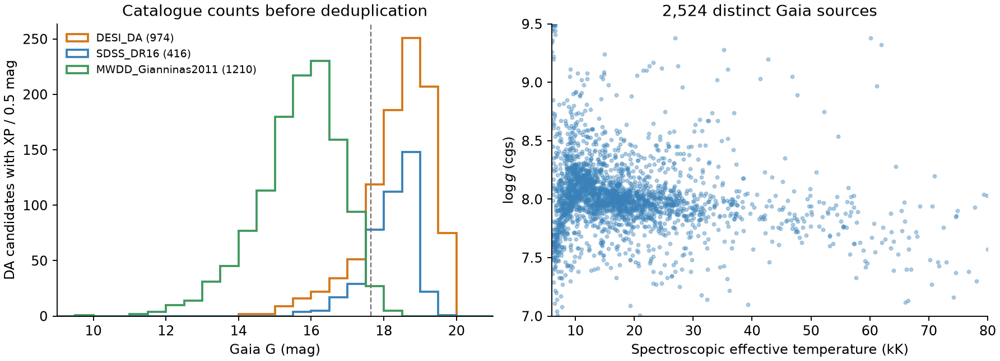

# WD 路线进展：2026-10-10

已从 `feat/subdwarf` 切出 `feat/whitedwarf`，完成第一轮锚点统计和大气表来源检查。

## 第一轮结果

光谱参数 DA 样本按 Gaia ID 去重后，有 **2524 颗**具备 XP 且在
Teff 6–80 kK、log g 7.0–9.5 内。**2064 颗**温度至少 13 kK，或目录提供了
3D 修正；再要求 RUWE < 1.4、视差信噪比 > 10，还剩 **2005 颗**。
数量上足以进入计划的 ≥200 档，但最终校正形式要等无校正残差出来后决定。

| 光谱参数来源 | 有 XP | 参数范围内的纯 DA |
| --- | ---: | ---: |
| DESI EDR / Manser+2024 | 1043 | 974 |
| SDSS DR16 / Kepler+2021 | 425 | 416 |
| MWDD 的 Gianninas+2011 子样本 | 1240 | 1210 |

各行包含重复天体，不能直接相加。

Gaia 查询的 6680 个有效 ID 全部返回。三颗 G>17.65 的 DA 已从 DataLink
下载到 XP_CONTINUOUS，源 ID 为 717674397913354880、1070456831149326208、
910001899563870592。Yamaguchi+2024 的 31 个系统也全部有 XP；已保存其 Gaia
对照表，尚未进行 SED 或轨道拟合。

Koester DA 网格在计划范围内有 **858 个节点**（78 个温度、11 个重力），
没有缺失组合。检查的 10000 K、log g 8 光谱覆盖 **89.9–2999.2 nm**，
覆盖 GALEX 和 Gaia；有限波长积分为 σTeff⁴ 的 **0.9938**，表面通量单位正确。
Bédard 厚氢层 0.6 M☉ 轨道在 10000 K 给出 **R=0.01283 R☉**、
冷却年龄 **0.633 Gyr**；表中重力与 GM/R² 一致。

## 当前决定

- 先构建无经验校正的 DA 表，画残差随 Teff、WD Balmer 等值宽度的变化。
- 单 DA 和零检验的判据已写入
  [validation-whitedwarf.md](../../docs/validation-whitedwarf.md)，尚未运行拟合。
- 原始目录、查询结果和逐源名单保存在 `data/whitedwarf/anchors/`；
  网格节点、单节点光谱和冷却序列在 `data/whitedwarf/models/`。
  `anchor_census.py` 和 `model_probe.py` 可重复生成本轮统计。

## 局限与待办

Kilic+2025 的光谱用于分类，温度和质量来自测光拟合，不计入独立光谱锚点。
Kepler+2021 的光谱拟合受 Gaia 视差约束，且没有应用 3D 修正；冷 DA 标签
还需单独处理。上述数量是候选数，尚未完成 XP 质量、标签尺度和隐藏伴星检查。

Koester 光谱不到 3 μm 以外，不能直接用于 W1/W2 或长波 SPHEREx。
下一步先完成 Gaia/GALEX 范围内的表；长波部分需另外验证。

任务 0 尚待补齐 SDSS WDMS、Nayak、Shahaf 和 Gentile Fusillo 测光控制样本的
覆盖统计；DB 光谱表来源也尚未落实。完整 DA 表、经验校正、β_G 上限接口
和拟合验证均未完成。

来源：[DESI 数据包](https://zenodo.org/records/13684288)、
[SDSS DR16](https://cdsarc.cds.unistra.fr/viz-bin/cat/J/MNRAS/507/4646)、
[MWDD](https://www.montrealwhitedwarfdatabase.org/tables-and-charts.html)、
[Kilic 的测光方法](https://arxiv.org/html/2412.04611v1#S4)、
[Gianninas 光谱分析](https://arxiv.org/abs/1109.3171)、
[Gaia XP 发布说明](https://doi.org/10.1051/0004-6361/202243940)、
[Yamaguchi 轨道样本](https://arxiv.org/html/2405.06020v1)、
[SVO Koester 表](https://svo2.cab.inta-csic.es/theory/newov2/index.php?models=koester2)、
[Bédard 冷却轨道](https://www.astro.umontreal.ca/~bergeron/CoolingModels/)。
