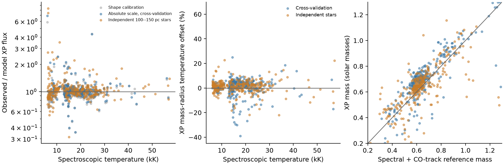

# 真实单DA尺度上的WD模型

默认 `WhiteDwarfModel()` 已用真实单DA定标，保留光谱的绝对亮度。
输入的温度、重力对应 DESI/Gianninas 光谱尺度；距离用 Gaia 视差，
消光用原生 Edenhofer E。294颗参与校正，另外289颗独立检验。

```python
from sedkit import WhiteDwarfModel

wd = WhiteDwarfModel()
prediction = wd.predict(teff=15000., mass=0.6)
flux_10pc = prediction["flux"]
```

`flux` 的单位是 `1e-18 W m^-2 nm^-1`，对应10 pc。
经验校正直接进入默认模型的XP61、六个蓝端通道和光学粗谱；
G/BP/RP光比也使用这套绝对尺度。



| 对照 | XP绝对通量中位偏差 | 默认M–R温度偏差 | 温度离散 |
| --- | ---: | ---: | ---: |
| 294颗，按源五折留出 | −0.22% | +1.70% | 4.12% |
| 289颗，独立100–150 pc样本 | +1.90% | +1.76% | 3.62% |

48颗低于13 kK的训练星，在留出验证中的绝对通量偏差由
−13.8%降到+0.1%。源间的绝对通量散布仍约10%；独立样本约14%。
这里的通量偏差是所有有效XP通道的线性通量拟合得到的整体亮度比，
没有按正通量或高信噪比挑通道来计算它。

校正是随log Teff分段线性变化、再加一个log g项的经验函数。
七个温度节点是7、10、13、18、25、40、80 kK。
整体亮度残差作为一个相关误差项，谱形残差作为逐通道误差，
避免把整颗星的亮度误差当成61次独立测量。
71颗有干净GALEX测量的单DA另外定了FUV/NUV绝对通量，
对数校正为−0.206/−0.071，谱形误差约11.6%/15.1%。

## 范围和限制

训练星在100 pc内、|b|>30度，有单DA光谱分类，排除了已知双星，
通过RUWE和视差质量筛选；冷星使用已有3D修正。
实际标签覆盖6003–56800 K、log g 7.37–9.26。
Edenhofer图内用均值和宽度；图内边界以内的近星采用E=0±0.005。
参数对照中同时拟合消光和目录视差约束。

40 kK以上只有6颗训练星和8颗独立星；独立样本的默认温度离散
约10.2%，绝对通量偏差约+12%。这部分尚没有整体样本的精度。
大气表覆盖6–80 kK、log g 7–9.5，不代表全域都有经验验证。

半径、质量和冷却年龄仍依赖厚氢层C/O关系。参考质量由光谱Teff/log g
和同一关系给出，不能视为独立动力学质量定标。
本轮定的是XP/光学和GALEX通量；JHK及短波SPHEREx仍是大气预测，
总光度也仍由冷却模型给出。隐藏伴星、光谱标签误差、视差和消光误差
都会进入源间散布。独立样本有23/289颗在参考标签处的绝对通量偏差
超过50%；中位偏差不是逐星准确度。复合星检测阈值需要按这套绝对尺度另外定标。

## 数据和复现

[anchors.ecsv](anchors.ecsv) 是294颗训练星，
[holdout_anchors.ecsv](holdout_anchors.ecsv) 是独立候选样本；其中289颗
在这套冷却关系内有参考质量。
[fits.ecsv](fits.ecsv) 和 [holdout_fits.ecsv](holdout_fits.ecsv)
保存逐星参数，[fluxes.ecsv](fluxes.ecsv) 和
[holdout_fluxes.ecsv](holdout_fluxes.ecsv) 保存绝对通量对照。
汇总在 [summary.json](summary.json)，消光矩在
[dust_moments.json](dust_moments.json)，GALEX测量在
[galex_anchors.json](galex_anchors.json)。

XP系数及校准光谱缓存于 `data/whitedwarf/xp_local100/` 和
`data/whitedwarf/xp_single_holdout150/`。缺少缓存时可用
`reports/wd_plan_20261010/xp_data.py` 中的 `acquire`、`calibrate_table`
按上述源列表获取。运行：

```bash
PYTHONPATH=src OPENBLAS_NUM_THREADS=1 OMP_NUM_THREADS=1 \
  python reports/wd_single_scale_20261010/calibrate.py
```

脚本完成真实单星校正和参数对照，写入默认
`src/sedkit/models/whitedwarf/calibration.npz`。
只重绘既有结果可运行 `compare_flux.py`。
`query_dust.py` 使用服务器上已有的Edenhofer后验图，路径写在脚本中。
